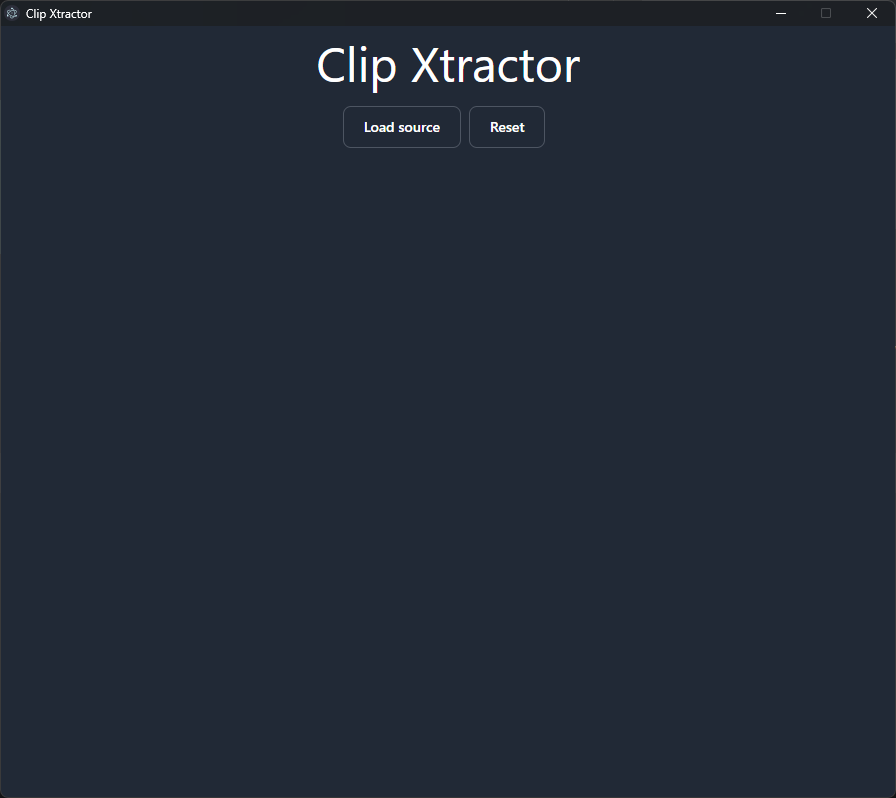
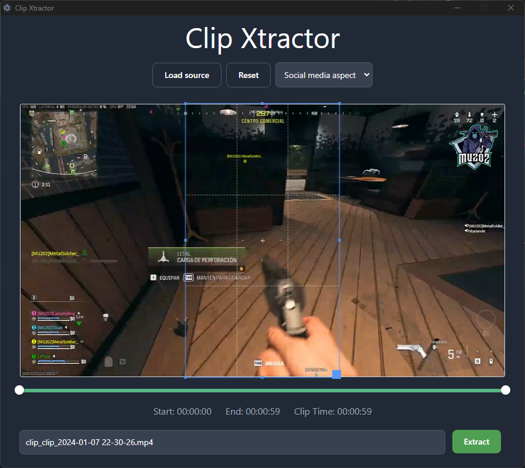

# Clip Xtractor


**Effortlessly extract clips from your videos!** ✂️

**Description:**

* **Simple and intuitive interface for easy clip extraction.**
* **Supports various video formats as input.**
* **Standalone application, no external dependencies required.**

**Prerequisites:**

1. **Download FFmpeg:** [https://ffbinaries.com/downloads](https://ffbinaries.com/downloads)
2. **Place FFmpeg in the `resources` folder:**

   ```
   resources/
   ├── linux/ffmpeg
   ├── mac/ffmpeg
   └── win/ffmpeg.exe
   ```

**Installation:**

1. **Clone the repository:**

   ```bash
   git clone https://github.com/le-pepe/clip-xtractor.git
   ```

2. **Install dependencies:**

   ```bash
   cd clip-xtractor
   yarn
   ```

**Development:**

1. **Start the development server:**

   ```bash
   yarn dev
   ```

**Build:**

1. **Compile TailwindCSS:**

   ```bash
   yarn tailwindcss -i ./src/renderer/src/assets/css/styles.css -o ./src/renderer/src/assets/css/app.css --watch --minify
   npx tailwindcss -i ./src/renderer/src/assets/css/styles.css -o ./src/renderer/src/assets/css/app.css --watch --minify
   ```

2. **Build the Vue project:**

   ```bash
   electron-vite build
   ```

3. **Package for your platform:**

   ```bash
   # Windows
   yarn build:win

   # macOS
   yarn build:mac

   # Linux
   yarn build:linux
   ```

**Screenshots:**






**Roadmap:**

- **Create a Logo**
- **Test on physical Linux and macOS devices**
- **Add tests**
- **Improve UI**
- **Add more options for customization**

**Contributing:**

Pull requests are welcome! Please follow the project's coding style and guidelines.

**License:**

MIT
